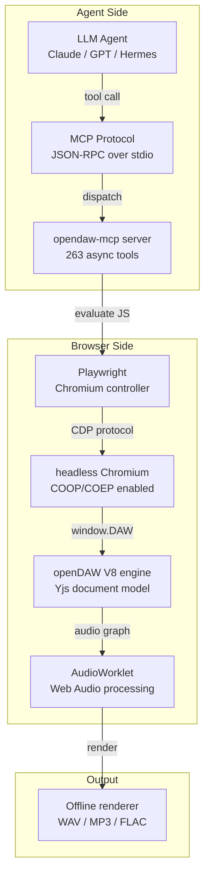
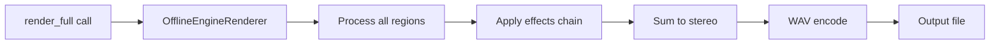

# Architecture

## Overview

opendaw-mcp bridges an LLM agent to [openDAW](https://github.com/andremichelle/openDAW) — a browser-based DAW
that runs entirely in the browser using the Web Audio API and AudioWorklets.



## The bridge

### HeadlessDawBridge

The core class that manages the Playwright connection to a headless Chromium
instance running openDAW.

```python
class HeadlessDawBridge:
    def __init__(self, daw_url: str = "http://localhost:5174")
    async def start(self) -> None      # launch browser, load DAW, wait for globals
    async def stop(self) -> None       # close browser
    async def evaluate(self, script: str) -> Any  # execute JS in V8 context
```

### Startup sequence

1. **Launch Chromium** via Playwright with `--enable-features=SharedArrayBuffer`
2. **Navigate** to the openDAW URL (port 5174)
3. **Wait for COOP/COEP** — `crossOriginIsolated` must be `true` for AudioWorklets
4. **Wait for DAW globals** — `window.DAW_InstrumentFactories`, `window.DAW_EffectFactories`, etc.
5. **Inject helpers** — typed box enumeration helpers (`DAW_HELPERS`) into the V8 context
6. **Ready** — all 263 tools can now operate

### DAW globals

The bridge exposes openDAW internals as `window.DAW_*` globals:

| Global | Purpose |
|--------|---------|
| `DAW` | Project root — `audioUnitFreeze`, `ScriptCompiler`, etc. |
| `DAW_InstrumentFactories` | Vaporisateur, Tape, Soundfont, Playfield, Apparat |
| `DAW_EffectFactories` | All audio effects (Delay, Dattorro, Compressor, etc.) |
| `DAW_ApparatDeviceBox` | Scriptable instrument box constructor |
| `DAW_WerkstattParameterBox` | Scriptable effect parameter box |
| `DAW_WerkstattSampleBox` | Scriptable effect sample slot |
| `DAW_audioContext` | AudioContext for ScriptCompiler |
| `DAW_HELPERS` | 17 typed box enumeration helpers |

### DAW_HELPERS

All box enumeration goes through typed helpers injected into the bridge context.
This avoids raw adapter calls in tool implementations:

| Helper | Returns |
|--------|---------|
| `h.auBox(i)` | AU box by index |
| `h.allAUBoxes()` | All audio unit boxes |
| `h.effectBoxes(au)` | Audio effects on an AU (sorted by index) |
| `h.midiEffectBoxes(au)` | MIDI effects on an AU |
| `h.trackBoxes(au)` | Tracks on an AU |
| `h.regionBoxes(track)` | Regions on a track |
| `h.eventBoxes(collection)` | Events in a collection |
| `h.inputBoxes(au)` | Input boxes on an AU |
| `h.markerBoxes(mt)` | Markers on a marker track |
| `h.sendBoxes(au)` | Aux sends on an AU |
| `h.busBoxes()` | All audio buses |
| `h.sampleBoxes(pf)` | Samples on a Playfield |
| `h.noteTrackBoxes(au)` | Note tracks only |
| `h.clipBoxes(track)` | Clips on a track |
| `h.rootClipBoxes()` | Root-level clips |
| `h.scriptParams(device)` | `@param` declarations |
| `h.scriptSamples(device)` | `@sample` declarations |

## Box model

openDAW uses a Yjs-based document model with typed boxes. Each box has numbered
fields (not named). The bridge accesses them via typed adapters:

```
AudioUnitBox
├── field 0: name (String)
├── field 4: tracks (ArrayField<TrackBox>)
├── field 12: audioEffects (ArrayField<EffectBox>)
├── field 21: midiEffects (ArrayField<EffectBox>)
├── field 14: sends (ArrayField<SendBox>)
└── ...

TrackBox
├── field 0: type (0=audio, 1=note)
├── field 4: clips (ClipCollection)
└── ...

NoteEventBox
├── position (PPQN, 960 = quarter note)
├── pitch (60 = C4)
├── velocity (0..1, default 0.787)
├── duration (PPQN)
├── cent (0)
├── chance (100)
└── ...
```

### Key conventions

- **`editing.modify()`** — all box mutations must happen inside an
  `editing.modify()` transaction block. Tools create separate blocks for
  different box operations.
- **PPQN** — positions are in pulses per quarter note. `PPQN.Quarter = 960`.
- **Field values** — `field.setValue(value)` sets the physical unit directly
  (dB, Hz, ratio, etc.). Use `field.constraints` to check min/max/type.
- **Attempt API** — factory calls return an `Attempt` object with
  `isSuccess()`, `result()`, `failureReason()`.
- **ArrayField** — use `.fields()` / `.size()`, not `.get()` / `.length`.

## Tool implementation pattern

Each of the 263 tools follows this pattern:

```python
@mcp.tool()
async def mcp_opendaw_set_bpm(bpm: float) -> dict:
    """Set the project tempo in BPM."""
    result = await bridge.evaluate(f"""
    () => {{
        const project = window.DAW;
        project.tempoTrack.setValue(...);
        return {{ success: true, bpm: {bpm} }};
    }}
    """)
    return result
```

The tool generates JavaScript that runs in the DAW's V8 context, accessing
the typed box model through the injected helpers.

## Offline rendering

Rendering uses openDAW's `OfflineEngineRenderer` which runs the full audio
graph at a specified sample rate (default 48000 Hz) without real-time
constraints. The output is a WAV file written to disk.



## Stem separation

opendaw-mcp integrates [SOTA stem separation models](https://github.com/ameobius/opendaw-mcp/tree/main/stem-splitter)
that run locally on GPU:

| Mode | Model | Use case |
|------|-------|----------|
| `ensemble` | BS-Roformer + HTDemucs | Best quality, slowest |
| `scnet` | SCNet | Sparse compression network |
| `bs6` | BS-Roformer 6-stem | drums/bass/vocals/other/guitar/piano |
| `polarformer` | MelBand Roformer | Polarized separation |
| `dereverb` | BS-Roformer dereverb | Remove reverb from stems |
| `drumsep` | Drum separation | Kick/snare/hat/toms |
| `denoise` | MelBand Roformer | Noise removal |

The `split_stems` tool takes an audio file path, runs separation, and can
optionally auto-import the resulting stems into the DAW as audio regions.
