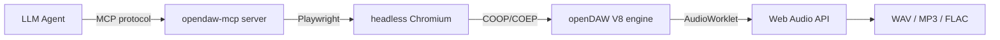

# opendaw-mcp

**556 MCP tools** for agent-native control of [openDAW](https://github.com/andremichelle/openDAW) — a browser-based digital audio workstation.

Control every aspect of music production from your LLM agent: synths, effects, MIDI, mixing, automation, rendering, stem separation, DSP scripting, and more.

## Why opendaw-mcp?

| Feature | opendaw-mcp | Generic MCP audio servers |
|---------|-------------|---------------------------|
| Tool count | 556 domain-specific | 5–20 generic |
| Browser bridge | Playwright + headless Chromium | Local CLI / API only |
| Real-time DAW control | Full mixer, transport, arrangement | Playback only |
| DSP scripting | Custom JS audio worklets | None |
| Stem separation | 7 SOTA models, GPU-local | API-dependent |
| Genre templates | 8 E2E-verified | None |
| Agent skills | 12 bundled | None |
| Orchestration tools | 80+ high-level composers | None |

## Quick numbers

- **556** MCP tools (`mcp_opendaw_*` prefix)
- **226** Python examples
- **134** DSP scripts (Werkstatt / Apparat / Spielwerk)
- **12** agent skills
- **6139** unit + E2E tests
- **0** ruff errors

## Install

```bash
pip install opendaw-mcp
```

Or run via Docker:

```bash
docker run -p 3000:3000 ghcr.io/ameobius/opendaw-mcp:1.14.4
```

## 30-second demo

```python
from opendaw_mcp.server import OpendawServer

server = OpendawServer()
await server.bridge.start()

# Create a full drum beat in one call
await server.mcp_opendaw_create_drum_pattern(
    pattern="x...x...x...x...|o.......o.....o.|..x...x...x...x.",
    unit_index=0
)

# Add a synth with reverb
await server.mcp_opendaw_create_synth_track(name="Lead")
await server.mcp_opendaw_add_effect(unit_index=1, effect_type="Dattorro")
await server.mcp_opendaw_set_effect_parameter(unit_index=1, effect_index=0, param="decay", value=0.6)

# Render
await server.mcp_opendaw_render_full(output_path="beat.wav")
```

## Architecture



The server connects to a headless Chromium instance running openDAW via Playwright. All 556 tools map to typed DAW operations through a bridge that injects typed helpers into the V8 context.

→ [Full architecture docs](architecture.md)
