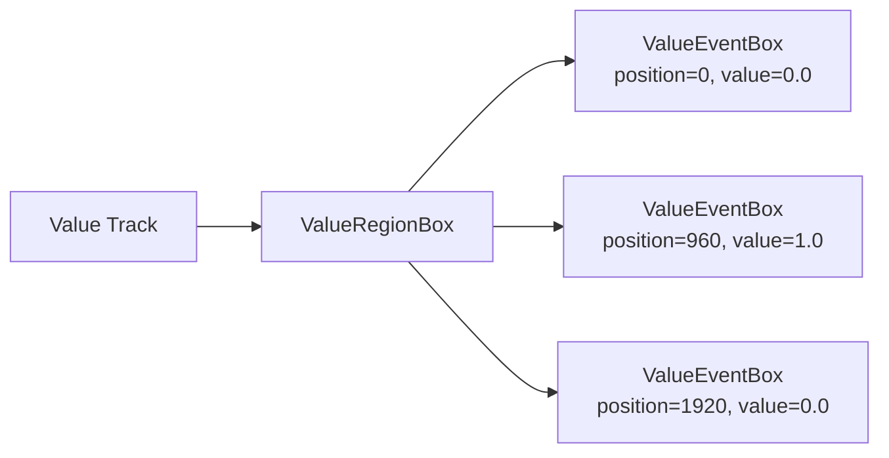

# Automation

12 tools for parameter automation.

## Automation (12)

| Tool | Description |
|------|-------------|
| `add_automation` | Add parameter automation to an effect on an AU |
| `add_instrument_automation` | Automate a parameter on the instrument connected to an AU |
| `create_automation_event` | Create a single automation event at a specific position |
| `delete_automation_event` | Delete a single automation event from an automation track |
| `duplicate_automation_event` | Duplicate an automation event within the same region |
| `get_automation_value` | Get the automation value at a specific position |
| `list_automation_events` | List automation events on a unit's automation tracks |
| `list_automation_events_detail` | List all events with full detail — position, value, interpolation |
| `list_value_regions` | List automation regions (ValueRegionBox) on value/automation tracks |
| `move_automation_event` | Move an automation event to a new position |
| `set_automation_interpolation` | Set interpolation type of an existing automation event |
| `update_automation_event` | Update an automation event's value and/or interpolation |

## How automation works

Automation is stored on **value tracks**. Each value track is associated with
a specific parameter on an effect or instrument. Automation events
(`ValueEventBox`) are placed at PPQN positions with a target value and
interpolation type.



### Interpolation types

| Type | Description |
|------|-------------|
| Linear | Straight line between events |
| Hold | Step value, no interpolation |
| Curve | Smooth curve between events |

### Example: filter sweep

```python
# Add a filter to a synth
await server.mcp_opendaw_add_effect(unit_index=0, effect_type="Revamp")
await server.mcp_opendaw_set_revamp_filter(
    unit_index=0, effect_index=0,
    filter_type="lowpass", frequency=200
)

# Automate the cutoff frequency
await server.mcp_opendaw_add_automation(
    unit_index=0, effect_index=0, param_name="frequency"
)

# Create a sweep: closed → open → closed
await server.mcp_opendaw_create_automation_event(
    unit_index=0, track_index=0,
    position=0, value=0.1, interpolation="linear"
)
await server.mcp_opendaw_create_automation_event(
    unit_index=0, track_index=0,
    position=3840, value=0.9, interpolation="linear"
)
await server.mcp_opendaw_create_automation_event(
    unit_index=0, track_index=0,
    position=7680, value=0.1, interpolation="linear"
)
```

### Orchestration shortcut

Use `automation_sweep` for a smooth ramp in one call:

```python
await server.mcp_opendaw_automation_sweep(
    unit_index=0, effect_index=0, param_name="frequency",
    start_position=0, end_position=3840,
    start_value=0.1, end_value=0.9,
    curve="log"  # or "linear", "exp"
)
```
