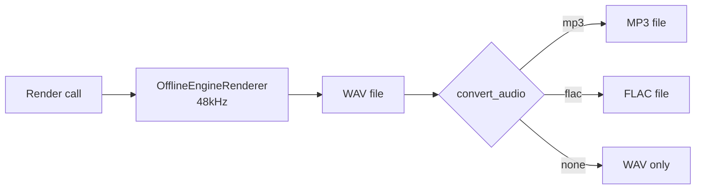

# Export & Rendering

17 tools for audio export, rendering, format conversion, and audio file management.

## Export & Rendering (13)

| Tool | Description |
|------|-------------|
| `auto_gain` | Auto-adjust output volume to hit a target LUFS |
| `convert_audio` | Convert an exported WAV to MP3 or FLAC using ffmpeg |
| `export_midi` | Export a note region's notes as a standard MIDI file (.mid) |
| `export_mix` | Render the full project mix to a WAV file |
| `export_single_stem` | Export a single AU as a stem WAV with its effect chain applied |
| `export_dry_stem` | Export a single AU as a DRY stem (instrument output, no effects) |
| `export_stems` | Export each AU as a separate stem WAV file |
| `export_stems_format` | Export stems and convert each to MP3 or FLAC |
| `import_midi` | Import a MIDI file and create note events on a note track |
| `load_audio` | Load an audio file (WAV/MP3/FLAC/OGG) into the project |
| `measure_lufs` | Measure LUFS (integrated) and true peak of an exported WAV |
| `render_full` | Render the entire project as a single stereo WAV |
| `render_full_format` | Render and convert to MP3 or FLAC in one step |
| `render_range` | Render only a portion of the project for quick A/B comparison |

### LUFS targets

| Platform | Target LUFS |
|----------|-------------|
| Spotify | -14 |
| Apple Music | -16 |
| YouTube | -14 |
| TIDAL | -14 |
| SoundCloud | -14 |
| CD master | -9 to -7 |

Use `auto_gain` with a target LUFS to automatically adjust output volume:

```python
await server.mcp_opendaw_auto_gain(target_lufs=-14)
```

### Rendering workflow



### Example: full mastering chain

```python
# Add mastering effects on the output bus
await server.mcp_opendaw_add_mastering_chain(
    style="balanced"  # or: warm, loud, transparent
)

# Render full mix
await server.mcp_opendaw_render_full(output_path="mix.wav")

# Measure loudness
lufs = await server.mcp_opendaw_measure_lufs(file_path="mix.wav")
print(f"Integrated: {lufs['integrated']} LUFS, True peak: {lufs['true_peak']} dBTP")

# Auto-adjust to target
if lufs['integrated'] > -14:
    await server.mcp_opendaw_auto_gain(target_lufs=-14)
    await server.mcp_opendaw_render_full(output_path="mix_mastered.wav")
```

## Audio Files (2)

| Tool | Description |
|------|-------------|
| `get_sample_info` | Get detailed info about an audio sample by UUID |
| `list_samples` | List all audio file samples used in the project |

## Presets & DawProject (4)

| Tool | Description |
|------|-------------|
| `export_dawproject` | Export the current project as .dawproject (Bitwig/Ableton compatible) |
| `export_preset` | Export an AU as a preset (base64-encoded binary) |
| `import_dawproject` | Import a .dawproject file into the current session |
| `import_preset` | Import a preset (base64-encoded binary) as a new audio unit |
