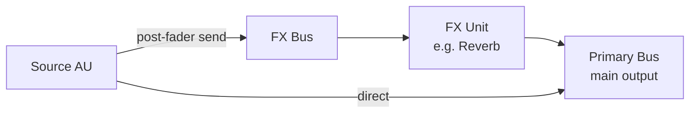

# Mixer & Sends

17 tools for mixing, routing, and send/return topology.

## Mixing (5)

| Tool | Description |
|------|-------------|
| `get_mixer_state` | Full mixer state — all AUs with volume, panning, mute, solo, type |
| `set_track_mute` | Mute or unmute an audio unit |
| `set_track_panning` | Set panning of an AU. -1.0 = full left, 0.0 = center, 1.0 = full right |
| `set_track_solo` | Solo or unsolo an audio unit |
| `set_track_volume` | Set volume of an AU in dB |

### Volume convention

Volume is in dB, mapped via a power curve:

- `0.0` → unity (0 dB)
- `-1.0` → -∞ dB (silent)
- `+1.0` → +6 dB

Use `set_track_volume(unit_index, volume_db)` — takes dB directly.

## Sends & Buses (12)

| Tool | Description |
|------|-------------|
| `create_audio_bus` | Create a new audio bus (aux bus) with its own AU and track |
| `create_send` | Create a parallel FX send bus from an audio unit |
| `list_audio_buses` | List all audio buses (primary output + FX buses) |
| `list_sends` | List all aux sends on an audio unit |
| `remove_audio_bus` | Remove an FX audio bus and its associated AU |
| `remove_send` | Remove an aux send from an audio unit |
| `set_bus_color` | Set the color (hue 0-360) of an audio bus |
| `set_bus_enabled` | Enable or mute an audio bus (FX bus A/B comparison) |
| `set_bus_label` | Set the label (name) of an audio bus |
| `set_send_level` | Set the send level for an existing aux send |
| `set_send_pan` | Set stereo pan for an aux send (-1.0 to 1.0) |
| `set_send_routing` | Set routing mode (pre-fader or post-fader) |

### Send topology



- **Source AU** sends a portion of its signal to an **FX Bus**
- **FX Bus** has its own AU with effects (e.g. reverb, delay)
- **FX Bus output** goes to the **Primary Bus** (main output)
- **Send level** controls how much signal is sent
- **Pre-fader** = send level independent of track volume
- **Post-fader** = send level follows track volume

### Example: reverb send

```python
# Create a reverb bus
bus = await server.mcp_opendaw_create_audio_bus(label="Reverb Bus")
bus_index = bus["bus_index"]

# Send from vocal AU to reverb bus
await server.mcp_opendaw_create_send(unit_index=0, bus_index=bus_index)

# Set send level
await server.mcp_opendaw_set_send_level(unit_index=0, send_index=0, level=0.4)

# Add reverb on the bus
await server.mcp_opendaw_add_effect(unit_index=bus_index, effect_type="Dattorro")
await server.mcp_opendaw_set_effect_parameter(
    unit_index=bus_index, effect_index=0, param="decay", value=0.7
)
```
