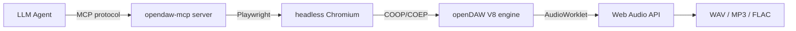

# Controlling a DAW with AI Agents: 520 Tools for openDAW via MCP

> What if your AI agent could arrange a full song, mix it, and master to -1 dBTP — all in one call?

**opendaw-mcp** gives an LLM agent full control of [openDAW](https://github.com/andremichelle/openDAW) — a browser-based digital audio workstation. **531 MCP tools**, 134 DSP scripts, 12 agent skills, 39 genre arrangements, stem separation, and a full docs site.

📖 **Full docs**: https://ameobius.github.io/opendaw-mcp/
📦 **PyPI**: `pip install opendaw-mcp`

Most "AI music" tools generate audio end-to-end. You prompt, it spits out a track. But real music production happens *inside* a DAW — tracks, effects, automation, mixing, rendering. That's where the craft lives.

What if an AI agent could work *inside* the DAW? Not generating audio, but *producing* it — the way a producer does?

That's what [opendaw-mcp](https://github.com/AMEOBIUS/opendaw-mcp) does. 520 MCP tools that give an LLM agent full control of [openDAW](https://github.com/andremichelle/openDAW) — a browser-based digital audio workstation.

## The setup



The agent talks MCP. The server translates to JavaScript that runs in openDAW's V8 context via Playwright. No API, no REST — direct DOM-level control of a real DAW engine.

## One call = full track, produced AND mastered

The killer feature is `produce_and_master` — a meta-tool that chains 7 steps in one call:

```python
from opendaw_mcp.server import OpendawServer

server = OpendawServer()
await server.bridge.start()

# One call = BPM + arrangement + drums + bass + genre effects + mastering + render
await server.mcp_opendaw_produce_and_master(
    structure="intro:4,verse:8,prechorus:2,chorus:8,bridge:4,chorus:8,outro:4",
    key_root="A",
    scale_type="minor",
    genre="house",
    bpm=124,
    platform="spotify",
    master_style="balanced",
    render=True
)
# → Complete mastered track rendered to WAV, -14 LUFS, -1 dBTP
```

This replaces 30-40 individual tool calls. The agent specifies structure, key, genre, tempo, and platform — everything else is automatic.

## What 531 tools looks like

The tools cover every aspect of music production:

| Category | Count | What you can do |
|----------|-------|-----------------|
| Transport & Tempo | 32 | BPM, time signatures, groove/shuffle, tempo automation |
| Tracks & Audio Units | 21 | Create, duplicate, freeze, move, delete tracks |
| Instruments | 4 | Vaporisateur synth, Tape, Soundfont, Playfield drums |
| Effects | 32 | Delay, reverb, compressor, waveshaper, EQ, vocoder... |
| Notes & MIDI | 48 | Create, quantize, transpose, duplicate notes and regions |
| Clips & Markers | 22 | Session view, clip launcher, song structure markers |
| Mixer & Sends | 17 | Volume, pan, mute, solo, FX sends, buses, routing |
| Automation | 12 | Parameter automation with interpolation curves |
| Export | 17 | Render full mix, per-stem, dry stems, MP3/FLAC, LUFS |
| Scriptable Devices | 5 | Custom JS DSP — write your own audio effects |
| Stem Separation | 2 | 7 SOTA models (BS-Roformer, HTDemucs, SCNet) on GPU |
| Orchestration | 250+ | Section generators, genre arrangements, meta-tools |

## Song structure pipeline

8 structural section generators, each with 5 style variants:

```
create_intro → create_prechorus → [chorus] → create_interlude →
create_transition → [chorus] → create_bridge → create_outro → create_coda
```

Or just call `arrange_full_song` with a structure string:

```python
await server.mcp_opendaw_arrange_full_song(
    structure="intro:4,prechorus:2,chorus:8,verse:8,bridge:4,outro:4",
    key_root="D", scale_type="major"
)
```

## Hardware compressor emulations

134 DSP scripts include faithful emulations of legendary hardware:

| Compressor | Model | Character |
|------------|-------|-----------|
| Thermal Comp | LA-2A optical | Smooth, program-dependent, tube warmth |
| FET Comp | Urei 1176 | Lightning-fast attack, aggressive |
| SSL Bus Comp | SSL G-series | The "glue" for mix bus, RMS detection |
| Nyquist Comp | Parallel/New York | Up-front without killing transients |

Plus a **true peak limiter** with inter-sample peak detection (4x oversampling) for streaming compliance — essential for mastering to -1 dBTP.

## Suno → openDAW pipeline

Here's where it gets unique. Suno generates tracks. openDAW-mcp can:

1. Split a Suno track into 6 stems (drums/bass/vocals/other/guitar/piano) using BS-Roformer
2. Import each stem into openDAW as a separate track
3. Add per-stem effects (saturation on bass, reverb send on vocals)
4. Add a MIDI arp layer with a scriptable synth
5. Render the enhanced mix
6. Measure LUFS and auto-adjust to -14 for streaming

```python
# Split Suno track into stems and auto-import
result = await server.mcp_opendaw_split_stems(
    file_path="suno_track.wav",
    mode="bs6",
    auto_import=True
)
# → 6 stems imported as audio tracks

# Master to -14 LUFS
await server.mcp_opendaw_auto_gain(target_lufs=-14)
await server.mcp_opendaw_render_full(output_path="mastered.wav")
```

AI generates → agent produces → DAW renders. No other tool provides this pipeline.

## Custom DSP in JavaScript

openDAW has scriptable devices — Werkstatt (audio effect), Apparat (instrument), Spielwerk (MIDI effect). You write JavaScript that runs as an AudioWorklet:

```javascript
// @werkstatt tapeSaturation 1 1
// @param {float} drive 0.3 0 1 "Drive"
// @param {float} mix 0.8 0 1 "Mix"

function processAudio(inputs, outputs, parameters) {
    for (let ch = 0; ch < inputs[0].length; ch++) {
        for (let i = 0; i < inputs[0][ch].length; i++) {
            let s = inputs[0][ch][i];
            s = Math.tanh(s * (1 + parameters.drive[ch] * 5));
            outputs[0][ch][i] = s * parameters.mix[ch] + inputs[0][ch][i] * (1 - parameters.mix[ch]);
        }
    }
}
```

134 ready-made DSP scripts ship with the project: tape saturation, wavefolding, bitcrush, spring reverb, chorus, phaser, shimmer, granular stretch, FM synth, ring mod, vocoder, psychoacoustic bass enhancer, SSL bus compressor, true peak limiter, LUFS meter, correlation meter, spectrum analyzer, and more.

## 39 genre arrangements

Want to start from a genre? 35+ multi-track arrangements are tested:

House, techno, DnB, neurofunk, liquid DnB, trap, dubstep, synthwave, trance, psytrance, disco, garage, acid, breakbeat, hardstyle, future bass, phonk, downtempo, ambient, lofi, afrobeat, reggae, rock, metal, country, jazz, pop, funk, soul, R&B, blues, gospel, EDM, and more.

```bash
python examples/one_call_production.py
```

## Install

```bash
pip install opendaw-mcp
```

Or Docker:

```bash
docker run -p 3000:3000 ghcr.io/ameobius/opendaw-mcp:latest
```

Full docs: **https://ameobius.github.io/opendaw-mcp/**

## Why this matters

AI music generation is solved — Suno, Udio, MusicGen do it well. But *production* — the craft of mixing, arranging, mastering — is still manual.

opendaw-mcp bridges that gap. An agent can now:

- Take a raw AI-generated track and *produce* it
- Build a full arrangement from scratch with musical intelligence
- Write custom DSP and deploy it in real-time
- Master to platform-specific LUFS targets

It's not replacing producers. It's giving agents the tools to *be* producers.

---

**Links:** [GitHub](https://github.com/AMEOBIUS/opendaw-mcp) · [PyPI](https://pypi.org/project/opendaw-mcp/) · [Docs](https://ameobius.github.io/opendaw-mcp/) · [Examples](https://github.com/AMEOBIUS/opendaw-mcp/tree/main/examples)

*Built on [openDAW](https://github.com/andremichelle/openDAW) by André Michelle. MCP tools, DSP scripts, and examples by AMEOBIUS.*
