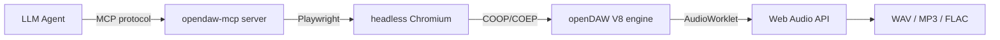

# Controlling a DAW with AI Agents: 263 Tools for openDAW via MCP

> What if your AI agent could mix a track, tune a synth, and master to -14 LUFS — without you touching a single knob?

Most "AI music" tools generate audio end-to-end. You prompt, it spits out a track. But real music production happens *inside* a DAW — tracks, effects, automation, mixing, rendering. That's where the craft lives.

What if an AI agent could work *inside* the DAW? Not generating audio, but *producing* it — the way a producer does.

That's what [opendaw-mcp](https://github.com/AMEOBIUS/opendaw-mcp) does. 263 MCP tools that give an LLM agent full control of [openDAW](https://github.com/andremichelle/openDAW) — a browser-based digital audio workstation.

## The setup



The agent talks MCP. The server translates to JavaScript that runs in openDAW's V8 context via Playwright. No API, no REST — direct DOM-level control of a real DAW engine.

## 30 seconds to a beat

```python
from opendaw_mcp.server import OpendawServer

server = OpendawServer()
await server.bridge.start()

# One call = full drum beat (kick | snare | hihat)
await server.mcp_opendaw_create_drum_pattern(
    pattern="x...x...x...x...|o.......o.....o.|..x...x...x...x.",
    unit_index=0
)

# Add a synth with reverb
await server.mcp_opendaw_create_synth_track(name="Lead")
await server.mcp_opendaw_add_effect(unit_index=1, effect_type="Dattorro")
await server.mcp_opendaw_set_effect_parameter(
    unit_index=1, effect_index=0, param="decay", value=0.6
)

# Render to WAV
await server.mcp_opendaw_render_full(output_path="beat.wav")
```

That's a full beat → synth → reverb → render pipeline in 5 lines. No clicking, no menus, no "File > Export".

## What 263 tools looks like

The tools cover every aspect of music production:

| Category | Count | What you can do |
|----------|-------|-----------------|
| Transport & Tempo | 32 | BPM, time signatures, groove/shuffle, tempo automation |
| Tracks & Audio Units | 21 | Create, duplicate, freeze, move, delete tracks |
| Instruments | 4 | Vaporisateur synth, Tape, Soundfont, Playfield drums |
| Effects | 32 | Delay, reverb, compressor, waveshaper, EQ, vocoder... |
| Notes & MIDI | 48 | Create, quantize, transpose, duplicate notes and regions |
| Clips & Markers | 22 | Session view, clip launcher, song structure markers |
| Mixer & Sends | 17 | Volume, pan, mute, solo, FX sends, buses, routing |
| Automation | 12 | Parameter automation with interpolation curves |
| Export | 17 | Render full mix, per-stem, dry stems, MP3/FLAC, LUFS |
| Scriptable Devices | 5 | Custom JS DSP — write your own audio effects |
| Stem Separation | 2 | 7 SOTA models (BS-Roformer, HTDemucs, SCNet) on GPU |
| Orchestration | 8 | High-level: drum patterns, chord progressions, mastering |

## The killer feature: orchestration tools

Individual tools are powerful but verbose. 8 orchestration tools combine multiple operations into one call:

```python
# Create a full chord progression from names — auto-voiced
await server.mcp_opendaw_create_chord_progression(
    chords=["Cm", "Fm7", "Gdom7", "Cm"],
    unit_index=1, track_index=0, duration=1920
)

# Add a mastering chain in one call
await server.mcp_opendaw_add_mastering_chain(style="balanced")

# Create a smooth filter sweep
await server.mcp_opendaw_automation_sweep(
    unit_index=0, effect_index=0, param_name="frequency",
    start_position=0, end_position=3840,
    start_value=0.1, end_value=0.9, curve="log"
)

# Apply a full mix preset
await server.mcp_opendaw_apply_mix_preset(preset="lofi")
```

One call replaces 10-50 low-level tool calls. For agents, this means fewer tokens, fewer round-trips, faster production.

## Suno → openDAW pipeline

Here's where it gets unique. Suno generates tracks. openDAW-mcp can:

1. Split a Suno track into 6 stems (drums/bass/vocals/other/guitar/piano) using BS-Roformer
2. Import each stem into openDAW as a separate track
3. Add per-stem effects (saturation on bass, reverb send on vocals)
4. Add a MIDI arp layer with a scriptable synth
5. Render the enhanced mix
6. Measure LUFS and auto-adjust to -14 for streaming

```python
# Split Suno track into stems and auto-import
result = await server.mcp_opendaw_split_stems(
    file_path="suno_track.wav",
    mode="bs6",
    auto_import=True
)
# → 6 stems imported as audio tracks

# Add reverb send on vocals
await server.mcp_opendaw_create_send(unit_index=2, bus_index=0)
await server.mcp_opendaw_set_send_level(unit_index=2, send_index=0, level=0.4)

# Master to -14 LUFS
await server.mcp_opendaw_auto_gain(target_lufs=-14)
await server.mcp_opendaw_render_full(output_path="mastered.wav")
```

AI generates → agent produces → DAW renders. No other tool provides this pipeline.

## Custom DSP in JavaScript

openDAW has scriptable devices — Werkstatt (audio effect), Apparat (instrument), Spielwerk (MIDI effect). You write JavaScript that runs as an AudioWorklet:

```javascript
// @werkstatt tapeSaturation 1 1
// @param {float} drive 0.3 0 1 "Drive"
// @param {float} mix 0.8 0 1 "Mix"

function processAudio(inputs, outputs, parameters) {
    for (let ch = 0; ch < inputs[0].length; ch++) {
        for (let i = 0; i < inputs[0][ch].length; i++) {
            let s = inputs[0][ch][i];
            s = Math.tanh(s * (1 + parameters.drive[ch] * 5));
            outputs[0][ch][i] = s * parameters.mix[ch] + inputs[0][ch][i] * (1 - parameters.mix[ch]);
        }
    }
}
```

26 ready-made DSP scripts ship with the project: tape saturation, wavefolding, bitcrush, reverb, chorus, phaser, shimmer, granular stretch, FM synth, ring mod, arpeggiator, and more.

## 8 genre templates — E2E verified

Want to start from a genre? 8 templates are tested end-to-end:

| Genre | BPM | What's included |
|-------|-----|-----------------|
| Techno | 130 | Driving 4-on-floor, hypnotic patterns |
| Coldwave | 100 | Dark post-punk, Dattorro + Waveshaper |
| Ambient | 70 | Pad + bell + texture, long reverbs |
| Hip-hop | 85 | Boom bap, 808 bass |
| DnB | 174 | Amen break, reese + sub |
| House | 124 | 4-on-floor, off-beat stabs |
| Lo-fi | 82 | Swung drums, ii-V-I jazz chords |
| Trap | 145 | Fast hi-hat rolls, gliding 808 |

```bash
python examples/genre_house.py
```

## Install

```bash
pip install opendaw-mcp
```

Or Docker:

```bash
docker run -p 3000:3000 ghcr.io/ameobius/opendaw-mcp:1.14.4
```

Full docs: **https://ameobius.github.io/opendaw-mcp/**

## Why this matters

AI music generation is solved — Suno, Udio, MusicGen do it well. But *production* — the craft of mixing, arranging, mastering — is still manual.

opendaw-mcp bridges that gap. An agent can now:

- Take a raw AI-generated track and *produce* it
- Build a full arrangement from scratch with musical intelligence
- Write custom DSP and deploy it in real-time
- Master to platform-specific LUFS targets

It's not replacing producers. It's giving agents the tools to *be* producers.

---

**Links:** [GitHub](https://github.com/AMEOBIUS/opendaw-mcp) · [PyPI](https://pypi.org/project/opendaw-mcp/) · [Docs](https://ameobius.github.io/opendaw-mcp/) · [Examples](https://github.com/AMEOBIUS/opendaw-mcp/tree/main/examples)

*Built on [openDAW](https://github.com/andremichelle/openDAW) by André Michelle. MCP tools, DSP scripts, and examples by AMEOBIUS.*
